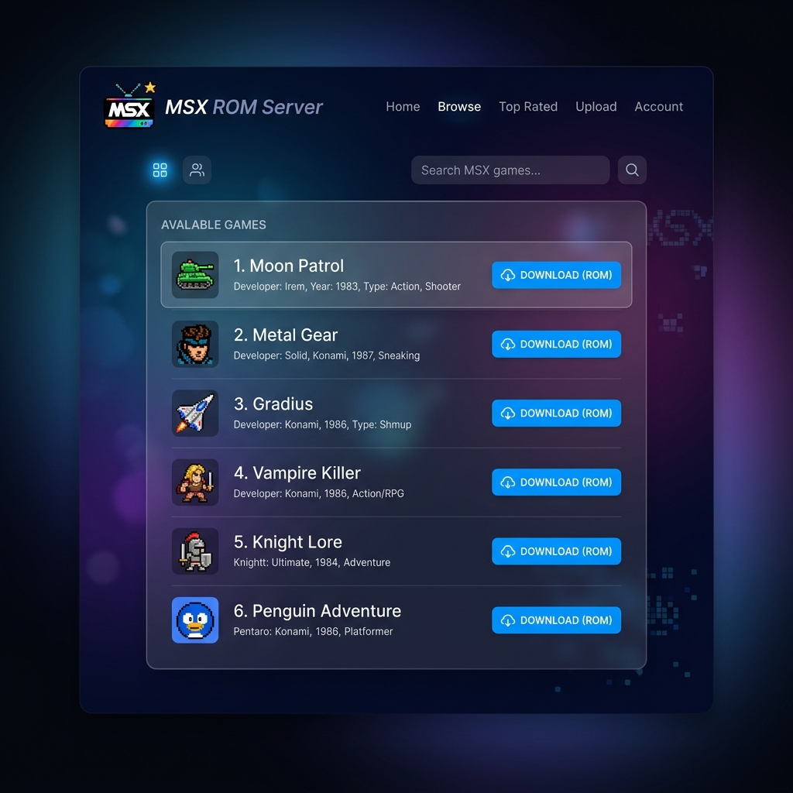

# MSX ROM Server (MSX-Flask)

MSX ROM Server is a lightweight, modern web application designed to serve retro MSX game ROMs (such as Moon Patrol) directly to your MSX Pico or other compatible flash cartridges.



## Features

- **Automated ROM Padding:** MSX Pico hardware requires `.rom` files to be at least `0x2000` (8192 bytes) in size. This server automatically pads smaller ROM files (e.g., converted `.com` files) with null bytes on-the-fly during download, without permanently altering the original files on the server!
- **Sleek Web Interface:** Enjoy a clean, responsive, and retro-themed web interface for browsing and downloading your favorite games.
- **Direct MSX Integration:** Download files directly to your MSX Pico via WiFi without ever needing to touch an SD card.

## Usage

1. Upload your MSX ROM files (both `.rom` and `.com` files are supported) to the `files/` directory.
2. If uploading a `.com` file for use with MSX Pico, simply rename it to `.rom` before uploading.
3. Access the web interface on your local network to browse your collection.
4. The server automatically ensures all `.rom` files meet the 8KB minimum size requirement for MSX Pico compatibility during the download process.

## Deployment

The application is deployed securely via SSH using the provided `scripts/manage_webapp.py` script.

To deploy to production:
```bash
python scripts/manage_webapp.py deploy prd
```

### Infrastructure Note
This project utilizes a built-in virtual environment deployment structure `python3 -m venv`. Earlier Ansible iterations relying on the standalone `virtualenv` module caused executable permission loss on Alpine Linux, which has now been fully resolved.
