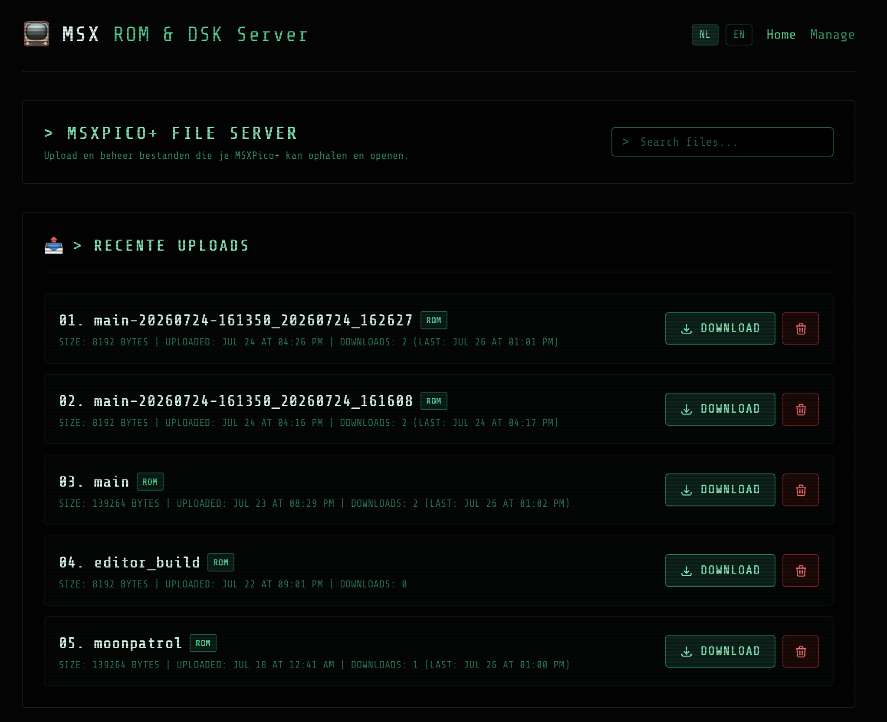

# MSX ROM & DSK Server (MSX-Flask)

MSX ROM & DSK Server is a lightweight, modern web application designed to serve retro MSX game ROMs, COM files, and DSK images directly to your MSX Pico or other compatible flash cartridges.



## Features

- **Retro Cyberpunk Design:** A fully responsive, mobile-friendly interface built with Tailwind CSS. Features a dark mode aesthetic, emerald green terminal text, and a CSS-based CRT scanline overlay for that authentic 80s/90s hacker feel.
- **Automated ROM Padding:** MSX Pico hardware requires `.rom` files to be at least `0x1000` (4096 bytes) in size. This server automatically pads smaller ROM files (e.g., converted `.com` files) with null bytes on-the-fly during download, without permanently altering the original files on the server!
- **Sleek Web Interface:** Enjoy a clean, responsive, and retro-themed web interface for browsing, managing (uploading/renaming/deleting), and downloading your favorite games.
- **Direct MSX Integration:** Download files directly to your MSX Pico via WiFi without ever needing to touch an SD card.

## Usage

1. Upload your MSX ROM files (both `.rom` and `.com` files are supported) to the `files/` directory.
2. If uploading a `.com` file for use with MSX Pico, simply rename it to `.rom` before uploading.
3. Access the web interface on your local network to browse your collection.
4. The server automatically ensures all `.rom` files meet the 8KB minimum size requirement for MSX Pico compatibility during the download process.

## Setup & Deployment (Docker)

The recommended way to run this server is using Docker Compose.

1. Clone the repository:
   ```bash
   git clone https://github.com/Pax-nl/msx-flask.git
   cd msx-flask
   ```
2. Copy the example environment file and configure it if needed:
   ```bash
   cp .env.example .env
   ```
3. Start the container in the background:
   ```bash
   docker compose up -d
   ```
The web server will now be available on port 80 (or the port you configured in `.env`). Your uploaded files are stored safely in the `files/` directory, which is persistently mounted.

## MSX Pico Configuration

To use the server directly from your MSX Pico cartridge:
1. Ensure your MSX Pico is connected to the same WiFi network as your Docker host.
2. Configure your MSX Pico by creating a file named `URL.TXT` inside the `FH_FILES` directory on your SD card. This file should contain exactly your new server's IP address (e.g., `http://192.168.1.100/`).
3. You can now browse and download ROMs directly from your MSX! The server automatically pads any small `.rom` files to the 8KB minimum requirement during the transfer so they run perfectly on the Pico hardware.
